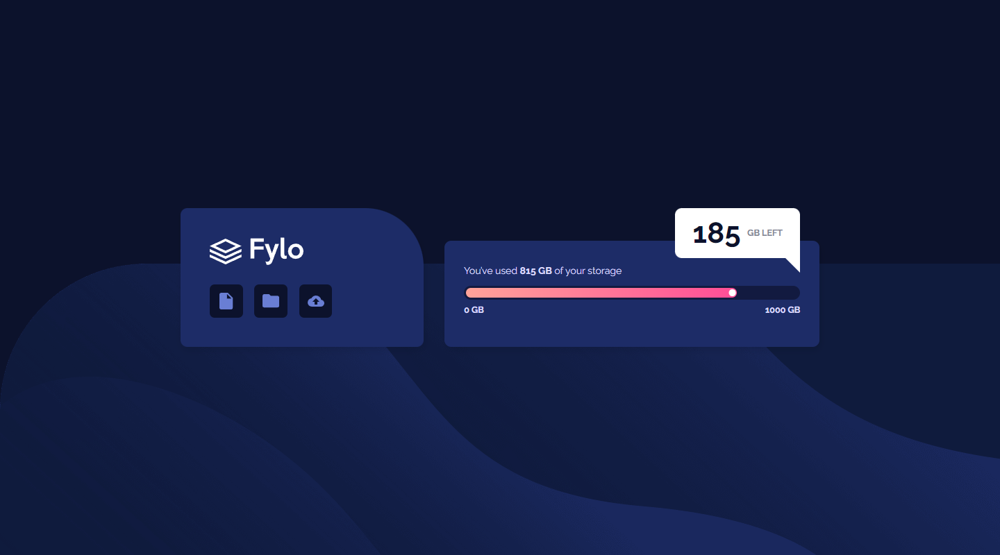
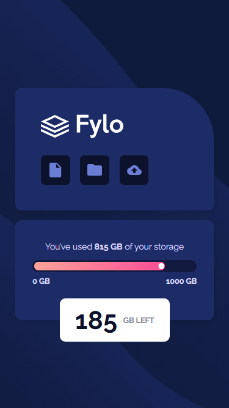

# Frontend Mentor - Fylo data storage component solution

This is a solution to the [Fylo data storage component challenge on Frontend Mentor](https://www.frontendmentor.io/challenges/fylo-data-storage-component-1dZPRbV5n). Frontend Mentor challenges help you improve your coding skills by building realistic projects. 

## Table of contents

- [Overview](#overview)
  - [Screenshot](#screenshot)
  - [Links](#links)
- [My process](#my-process)
  - [Built with](#built-with)
  - [What I learned](#what-i-learned)
- [Author](#author)

## Overview

### Screenshot

### Links

- Live Site URL: [Fylo data storage component](https://fylo-data-storage-component.dodeun.com/)

## My process

### Built with

- Semantic HTML5 markup
- CSS custom properties
- Flexbox
- Mobile-first workflow
- SASS

### What I learned

I am slowly getting a better understanding of all the background styling rules, I think I managed to get a decent result even though it doesnt exactly react like I would want it to.

I had fun with the challenge, especially with the storage "progress bar" making it responsive and adding the white dot was interesting.

## Author

- Frontend Mentor - [@Dodeun](https://www.frontendmentor.io/profile/Dodeun)
